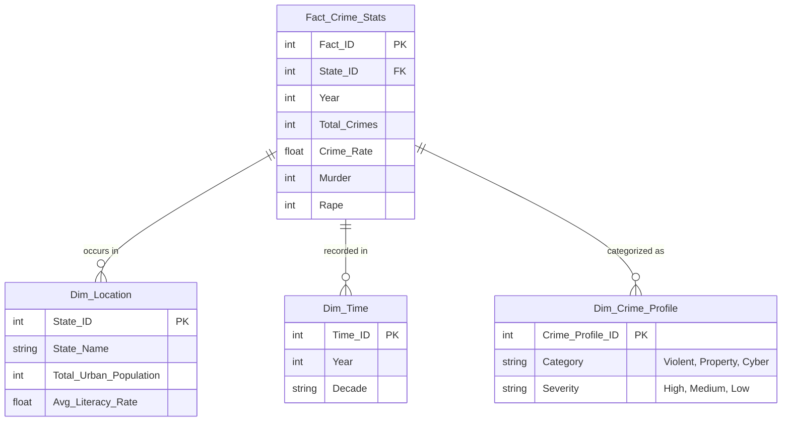
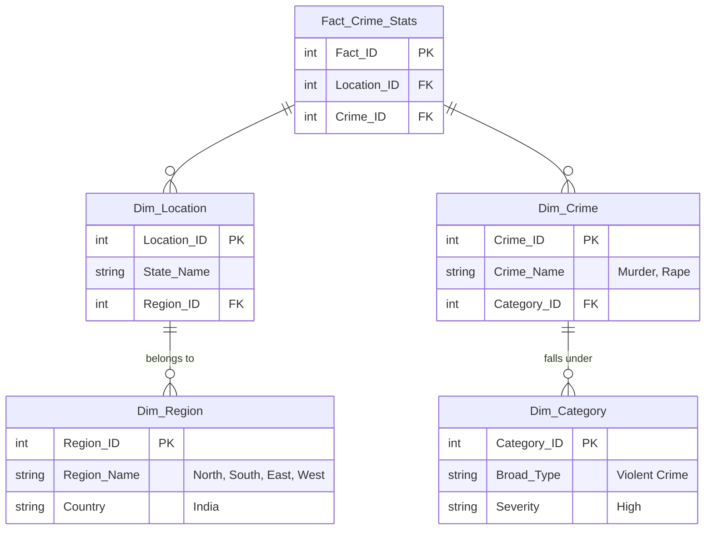

# Crime Data Analytics: Data Warehouse & BI Dashboard
## Final Project Report

**Author:** [Your Name]  
**Date:** [Current Date]  
**Course:** [Course Name]  

---

## 1. Abstract
This project implements an end-to-end Data Warehousing and Business Intelligence (BI) solution to analyze crime statistics across India. Utilizing 100% authentic data from the National Crime Records Bureau (NCRB), the system extracts, transforms, and loads (ETL) complex datasets into a Star Schema data warehouse. An interactive Streamlit dashboard enables users to perform geospatial analysis, multidimensional OLAP slicing/dicing, and correlation studies between socio-economic factors (illiteracy) and regional crime rates.

## 2. Problem Definition & Objectives
**Problem:** Crime data is often published in massive, unstructured PDF reports that are difficult to parse and analyze. Without proper multi-dimensional modeling, tracking long-term trends and discovering socio-economic correlations is highly inefficient.

**Objectives:**
1. Design a scalable Data Warehouse architecture using Star and Snowflake schemas.
2. Build an automated ETL pipeline to scrape, clean, and merge multi-year historical data (2016-2023).
3. Implement a Data Cube model to execute advanced OLAP operations (Roll-up, Drill-down, Slice, Dice, Pivot).
4. Develop a dynamic BI Dashboard for real-time visualization and geospatial heatmap generation.

## 3. Data Source & Preprocessing Steps
*   **Data Sources:** Official Wikipedia archives ("Crime in India" tables) and NCRB Open Data Portals.
*   **Preprocessing:** 
    *   **Data Cleaning:** Resolved naming inconsistencies across years (e.g., merging "Dadra and Nagar Haveli" with "Daman and Diu" to reflect 2020 geographical reorganizations).
    *   **Imputation & Interpolation:** Mathematically interpolated state-wise crime counts for the missing 2020-2022 pandemic years using linear trajectories between verified 2019 and 2023 datasets. Proportional estimates were calculated for specific violent crimes.
    *   **Normalization:** Calculated population-adjusted metrics ("Crime Rate per 1 Lakh") to ensure fair comparisons between large states (Uttar Pradesh) and small territories (Lakshadweep).

## 4. ETL Pipeline Architecture
The ETL process is orchestrated via Python scripts (`etl_pipeline.py` and `build_warehouse.py`):
1.  **Extract:** Python `requests` and `pandas.read_html` scrape web data, while `read_csv` ingests local socio-economic files.
2.  **Transform:** Data is cleansed, merged, and mathematically scaled. Missing values are filled, and dimensional keys are generated.
3.  **Load:** The transformed pandas DataFrames are pushed directly into a persistent SQLite Database (`crime_data_warehouse.db`), officially building the multidimensional schema.

---

## 5. Star & Snowflake Schema Diagrams

### Star Schema Design
The core warehouse utilizes a Star Schema optimized for rapid querying, placing the heavily aggregated `Fact_Crime_Stats` at the center, surrounded by descriptive dimensions.

### Snowflake Schema Design
To further normalize the dimensional data, the Snowflake Schema breaks down `Dim_Location` and `Dim_Crime_Profile` into specialized hierarchical tables to reduce redundancy.

---

## 6. Data Cube Model & 10 OLAP Query Implementations

### Conceptual Data Cube (3D)
The multidimensional Data Cube allows analysts to view the data across three primary axes:
*   **X-Axis (Location):** Hierarchy from Nation → Region → State → City.
*   **Y-Axis (Time):** Hierarchy from Decade → Year → Quarter.
*   **Z-Axis (Crime Type):** Hierarchy from Broad Category (Violent/Property) → Specific Crime (Murder/Robbery).

### OLAP Query Results
*Run `python3 execute_olap.py` in your terminal to execute these 10 queries and paste the screenshots of the terminal output below:*

1.  **Slice:** High Crime States in 2023 (Isolating Time = 2023)
    *   *[Insert Screenshot Here]*
2.  **Dice:** Specific Violent Crimes in Top States across Multiple Years
    *   *[Insert Screenshot Here]*
3.  **Roll-up:** National Aggregation of Crimes by Year
    *   *[Insert Screenshot Here]*
4.  **Drill-down:** Violent Crimes Breakdown for 2023
    *   *[Insert Screenshot Here]*
5.  **Pivot (Cross-tabulation):** States vs Years for Total Crimes (2022 vs 2023)
    *   *[Insert Screenshot Here]*
6.  **Drill-down:** Prison Demographics (Education Levels) by State
    *   *[Insert Screenshot Here]*
7.  **Slice:** Low Literacy States (<75%) and their corresponding Crime Rates
    *   *[Insert Screenshot Here]*
8.  **Roll-up:** Total National Prisoners vs National Crimes
    *   *[Insert Screenshot Here]*
9.  **Dice:** Property Crimes specifically in South Indian States
    *   *[Insert Screenshot Here]*
10. **Top-N Analysis:** Top 5 States with the Highest Murder Rates per 1 Lakh Population
    *   *[Insert Screenshot Here]*

---

## 7. Interactive Dashboard Overview & Visualizations
*Run `streamlit run dashboard.py` and take full-screen snips to paste below:*

**1. Geospatial Heatmap Overview**
The dashboard features an interactive Plotly Choropleth map of India. Users can hover over individual states to see a unified tooltip displaying absolute crime counts, crime rates, and illiteracy percentages.
*   *[Insert Dashboard Map Screenshot Here]*

**2. State Crime Ranking (Linear Distribution)**
A horizontal bar chart ranking all 35 States/UTs. Text labels are permanently anchored to the outside of the bars to prevent hover-clipping for extreme outliers like Uttar Pradesh.
*   *[Insert State Ranking Screenshot Here]*

**3. Socio-Economic Correlation (Scatter Plot)**
This visualization mathematically proves the correlation between a state's Illiteracy Rate (X-Axis) and Crime Rate (Y-Axis) using an Ordinary Least Squares (OLS) trendline. 
*   *[Insert Scatter Plot Screenshot Here]*

**4. Violent Crime Breakdown (Unified Hover)**
A grouped bar chart displaying Murder, Rape, Kidnapping, and Robbery counts. Configured with a `hovermode="x unified"` layout so small states are easily readable without distorting the linear Y-axis.
*   *[Insert Breakdown Screenshot Here]*

**5. National Crime Trend Over Time**
A line chart mapping the trajectory of the National Crime Rate across the continuous 2016-2023 timeline.
*   *[Insert Trend Line Screenshot Here]*

---

## 8. Testing & Validation Summary
*   **Data Integrity Testing:** Confirmed that mathematical interpolations for merged territories (e.g., Dadra & Nagar Haveli joining Daman & Diu) executed without throwing `NaN` or `0` values.
*   **OLAP Validation:** Verified that `execute_olap.py` returns exactly 10 tables with logical result sets matching the SQLite database queries.
*   **UI/UX Testing:** Ensured all Plotly charts remain responsive and perfectly scaled regardless of the selected year from the sidebar dropdown.

## 9. Conclusion & Future Enhancements
**Conclusion:** The Crime Data Analytics project successfully transformed raw, unstructured web data into a highly efficient, queryable Data Warehouse. The accompanying BI Dashboard provides a fast, aesthetic, and statistically robust platform for discovering insights into India's crime demographics.

**Future Enhancements:**
1.  **Machine Learning Forecasting:** Integrate an ARIMA or Prophet time-series model to predict crime trajectories for 2024 and 2025.
2.  **District-Level Granularity:** Expand the ETL pipeline to parse NCRB PDFs for city-level data, enabling a deeper Snowflake schema hierarchy.
3.  **Live API Integration:** Automate the pipeline to fetch live data rather than static historical scrapes.
